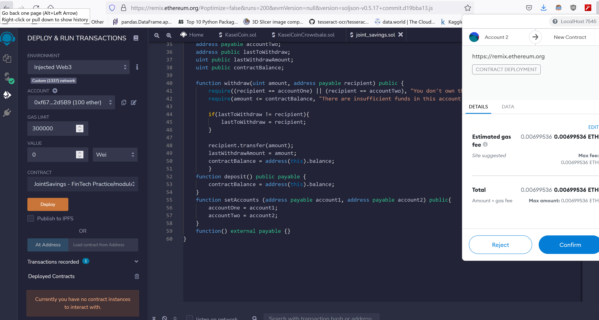
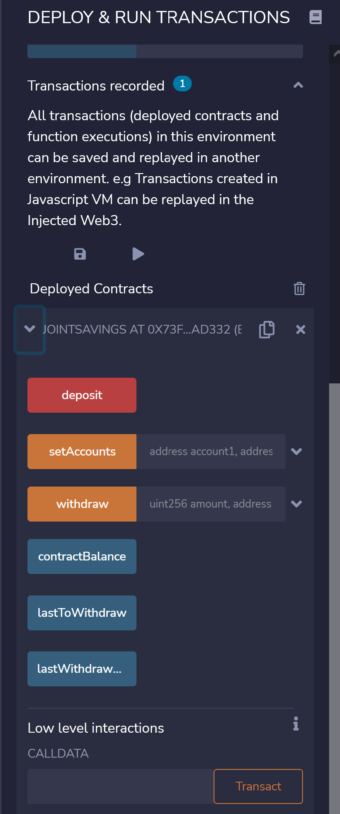
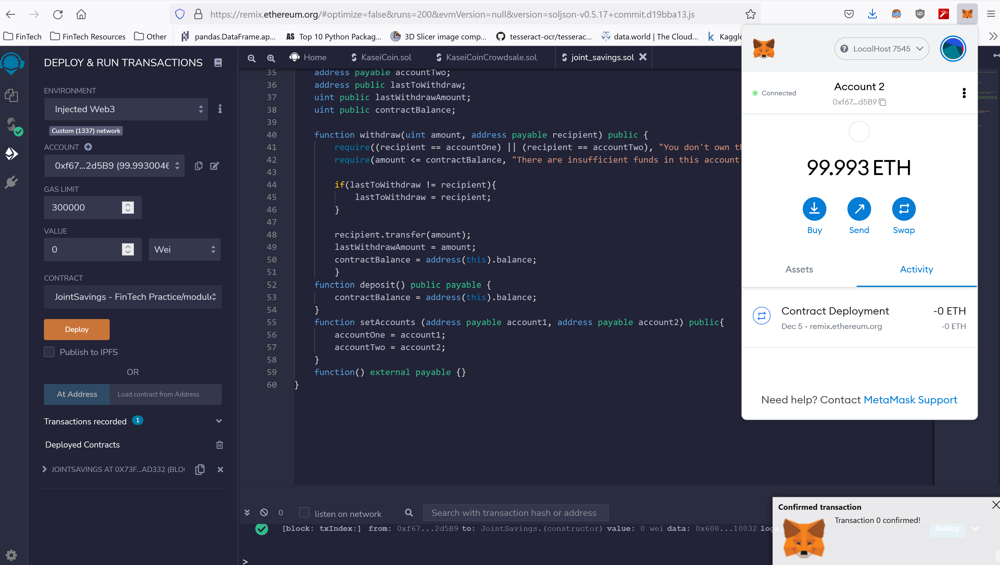
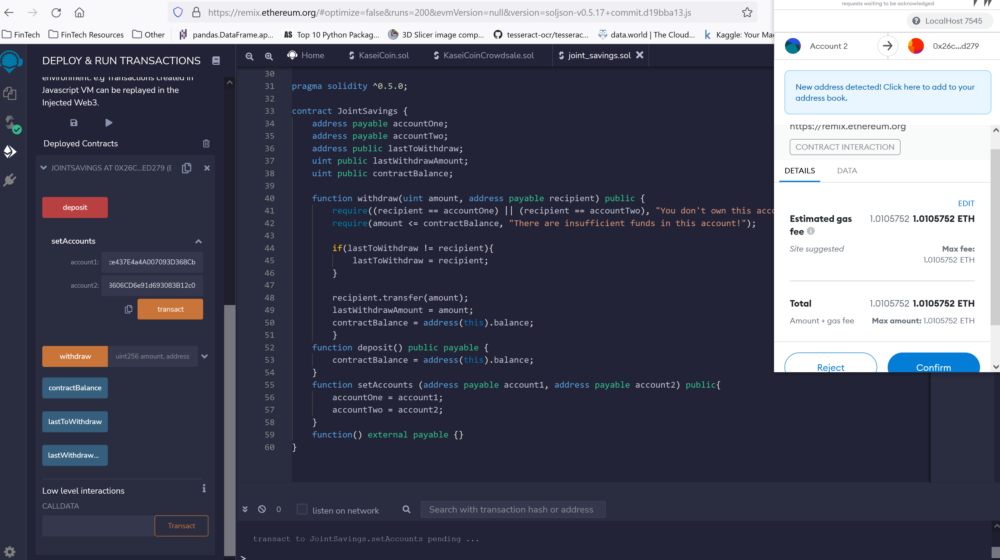
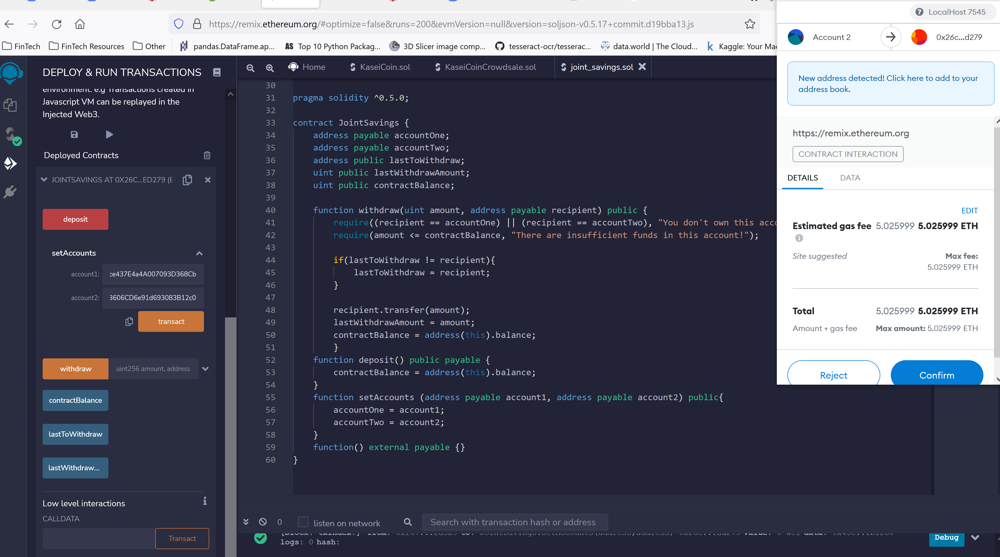
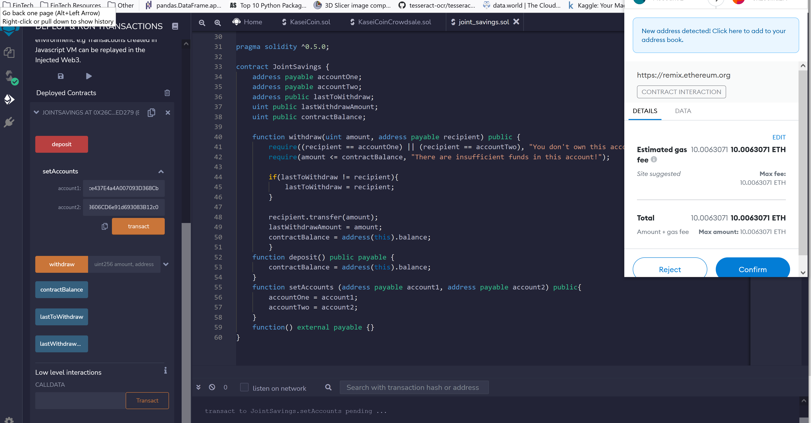
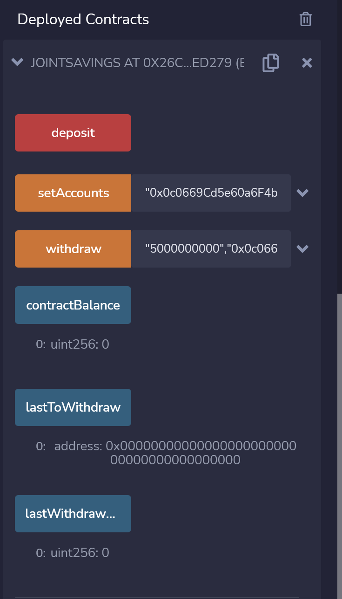

<div id="top"></div>
<br />

<h3 align="center">Smart Contract- JointSavings</h3>

  <p align="center">
  This projects focuses on automating the creation of joint savings accounts using SmartContracts for financial institutions. 
    <a href="https://github.com/jtengsico/20-Smart-Contracts-with-Solidity.git">
  </p>
</div>

<!-- TABLE OF CONTENTS -->
<details>
  <summary>Table of Contents</summary>
  <ol>
    <li><a href="#built-with">Built With</a></li>
    <li><a href="#installation">Installation</a></li>
    <li><a href="#usage">Usage</a></li>
    <li><a href="#license">License</a></li>
    <li><a href="#acknowledgments">Acknowledgments</a></li>
  </ol>
</details>

<p align="right">(<a href="#top">back to top</a>)</p>

<!-- Built With -->

### Built With
* Solidity 
* Remix
* Metamask
* Ganache

<p align="right">(<a href="#top">back to top</a>)</p>

<!-- Installation -->
### Installation 

To setup this program on your desktop, please clone the repo.
After cloning the repo, go .
   ```sh
   git clone https://github.com/jtengsico/20-Smart-Contracts-with-Solidity.git
   ```
You can run all of the .sol files in Remix. 
For Metamask and Ganache, you will need to set up an account in order to use them to send ether. 

<p align="right">(<a href="#top">back to top</a>)</p>

<!-- Execution Results -->
### Execution Results

1. Deployment of Contract


2. Run Transactions
  

3. ETH Balance


4. Send 1 ETH


5. Send 5 ETH


6. Send 10 ETH
  

7. Withdrawal of ETH


<p align="right">(<a href="#top">back to top</a>)</p>

<!-- LICENSE -->
### License

Distributed under the MIT License.
See [license txt](https://github.com/git/git-scm.com/blob/main/MIT-LICENSE.txt)

<p align="right">(<a href="#top">back to top</a>)</p>

<!-- ACKNOWLEDGMENTS -->
### Acknowledgments
Credit to creator of readme template. The repo also has useful resources. 
* [README Template](https://github.com/othneildrew/Best-README-Template.git)

<p align="right">(<a href="#top">back to top</a>)</p>
